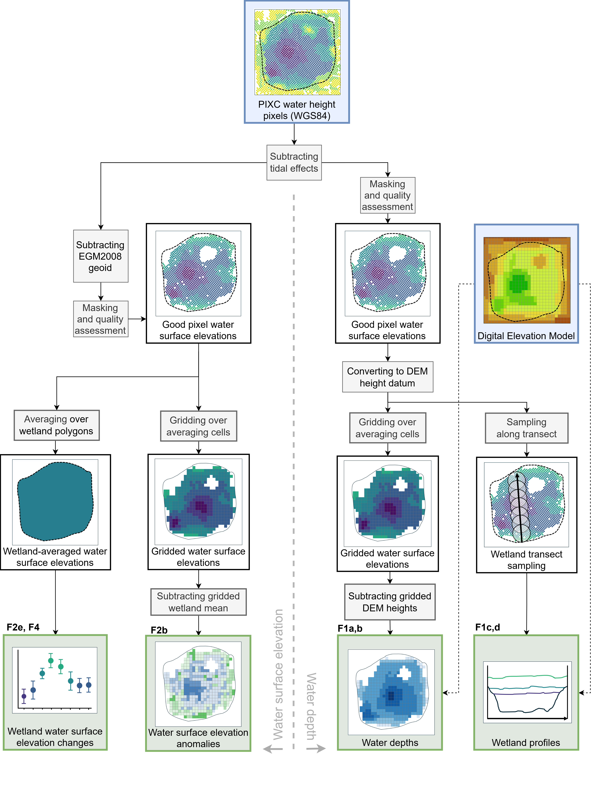

# SWOT reveals flood depths and environmental flows in wetlands

Mia Callaway, Maya Taib, Paul Tregoning, Chris Gouramanis and Lachlan Dodd

Contact emails: Mia.Callaway@anu.edu.au, Maya.Taib@anu.edu.au, Paul.Tregoning@anu.edu.au

Research School of Earth Sciences

The Australian National University

*Communications Earth & Environment*, submitted October 2025

### Abstract
> Wetland ecosystems depend on water availability to function. However, detailed information on water heights and depths within wetlands is often lacking, and management of these vulnerable ecosystems can rely on distant river gauge measurements or no water observations at all. Here we show that Surface Water and Ocean Topography (SWOT) satellite data can provide water height estimates across  internationally recognised Ramsar wetlands in Australia - Coongie Lakes and the Barmah-Millewa Forest - with 3-10 cm accuracy. Combined with high-resolution elevation data, water depths can now be monitored in wetlands every ~10-11 days, providing crucial information on water availability to sustain ecosystems. The largest ever satellite-observed flood in the Coongie Lakes was tracked with unprecedented detail as it flowed through interconnected channels and lakes of the system, and we mapped wetland extents from the SWOT data. Our approach can improve management of all wetlands lacking information on water heights and depths.

### How is it done?
We process SWOT Pixel Cloud (PIXC) data to generate spatially gridded water depth estimates, wetland profiles, gridded water height anomalies and time series of wetland-averaged water heights. Details on methods used are described in the Methods section of Callaway *et al.* (2025).

### Software
We provide two python scripts and a Jupyter notebook to permit users to perform the computations: 

`swot_wetland_functions.py`: Script containing functions and files to compute, plot and save outputs generated in the paper. 

`site_specific_variable.py`: Study site specific variables used in the functions in SWOT_Wetland_Functions.py which need to be replaced for the wetland of interest. 

`paper_output_code.ipynb`: Script to call the functions in the SWOT_Wetland_Functions.py script and generate the main figure outputs presented in the paper. 

`swot_wetlands.tar.gz`: Tar file of above scripts and notebooks. 

### Input Data Files
All data used to produce the main figures in the paper can be downloaded from their native source locations. SWOT Level 2 Water Mask Pixel Cloud Data Product, Version C and D data are available from [NASA Earthdata](https://search.earthdata.nasa.gov/search?q=SWOT). The in situ gauge data used in this study are available from the [Australian Bureau of Meteorology](https://www.bom.gov.au/waterdata/). LiDAR data for Coongie Lakes is available from [ELVIS](https://elevation.fsdf.org.au/).

### Citation
This work is described in detail in Callaway *et al.* (2025). Please cite this paper if you use this code. 

M. Callaway, M. Taib, P. Tregoning, C. Gouramanis and L. Dodd (2025), "SWOT reveals flood depths and environmental flows in wetlands", *Communications Earth & Environment*, submitted October 2025. 
